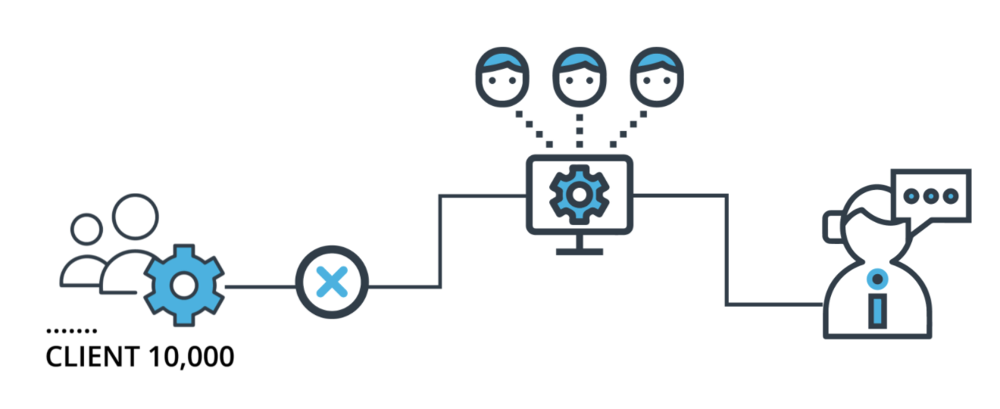

# Background

Imagine that you're the Chief Data Scientist at a big company that has 10,000 corporate clients. Your company is extremely concerned about attrition risk: the risk that some of their clients will exit their contracts and decrease the company's revenue. They have a team of client managers who stay in contact with clients and try to convince them not to exit their contracts. However, the client management team is small, and they're not able to stay in close contact with all 10,000 clients.

The company needs you to create, deploy, and monitor a risk assessment ML model that will estimate the attrition risk of each of the company's 10,000 clients. If the model you create and deploy is accurate, it will enable the client managers to contact the clients with the highest risk and avoid losing clients and revenue.

Creating and deploying the model isn't the end of your work, though. Your industry is dynamic and constantly changing, and a model that was created a year or a month ago might not still be accurate today. Because of this, you need to set up regular monitoring of your model to ensure that it remains accurate and up-to-date. You'll set up processes and scripts to re-train, re-deploy, monitor, and report on your ML model, so that your company can get risk assessments that are as accurate as possible and minimize client attrition.




## Dependencies
* All the dependencies are listed in the `requirements.txt` file. You can setup a virtual environment using [Anaconda](https://www.anaconda.com/products/distribution) and install the required dependencies there.

## Setup

```bash
> conda env create -f environment.yml
> conda activate riskass
```

If environment needs modifications, reinstall after:
```bash
> conda env remove -n riskass
```


## Steps

You'll complete the project by proceeding through 5 steps:

1. Data ingestion. Automatically check a database for new data that can be used for model training. Compile all training data to a training dataset and save it to persistent storage. Write metrics related to the completed data ingestion tasks to persistent storage.
2. Training, scoring, and deploying. Write scripts that train an ML model that predicts attrition risk, and score the model. Write the model and the scoring metrics to persistent storage.
3. Diagnostics. Determine and save summary statistics related to a dataset. Time the performance of model training and scoring scripts. Check for dependency changes and package updates.
4. Reporting. Automatically generate plots and documents that report on model metrics. Provide an API endpoint that can return model predictions and metrics.
5. Process Automation. Create a script and cron job that automatically run all previous steps at regular intervals.

## Starter Files
There are many files in the starter: 10 Python scripts, one configuration file, one requirements file, and five datasets.

The following are the Python files that are in the starter files:

* training.py, a Python script meant to train an ML model
* scoring.py, a Python script meant to score an ML model
* deployment.py, a Python script meant to deploy a trained ML model
* ingestion.py, a Python script meant to ingest new data
* diagnostics.py, a Python script meant to measure model and data diagnostics
* reporting.py, a Python script meant to generate reports about model metrics
* app.py, a Python script meant to contain API endpoints
* wsgi.py, a Python script to help with API deployment
* apicalls.py, a Python script meant to call your API endpoints
* fullprocess.py, a script meant to determine whether a model needs to be re-* deployed, and to call all other Python scripts when needed
The following are the datasets that are included in your starter files. Each of them is fabricated datasets that have information about hypothetical corporations.

Note: these data have been uploaded to your workspace as well

* dataset1.csv and dataset2.csv, found in /practicedata/
* dataset3.csv and dataset4.csv, found in /sourcedata/
* testdata.csv, found in /testdata/
The following are other files that are included in your starter files:

* requirements.txt, a text file and records the current versions of all the modules that your scripts use
* config.json, a data file that contains names of files that will be used for configuration of your ML Python scripts